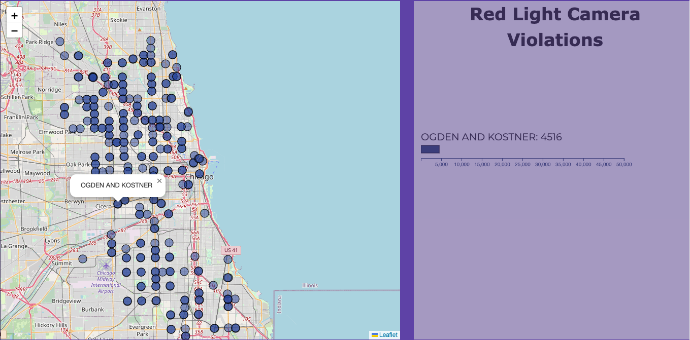
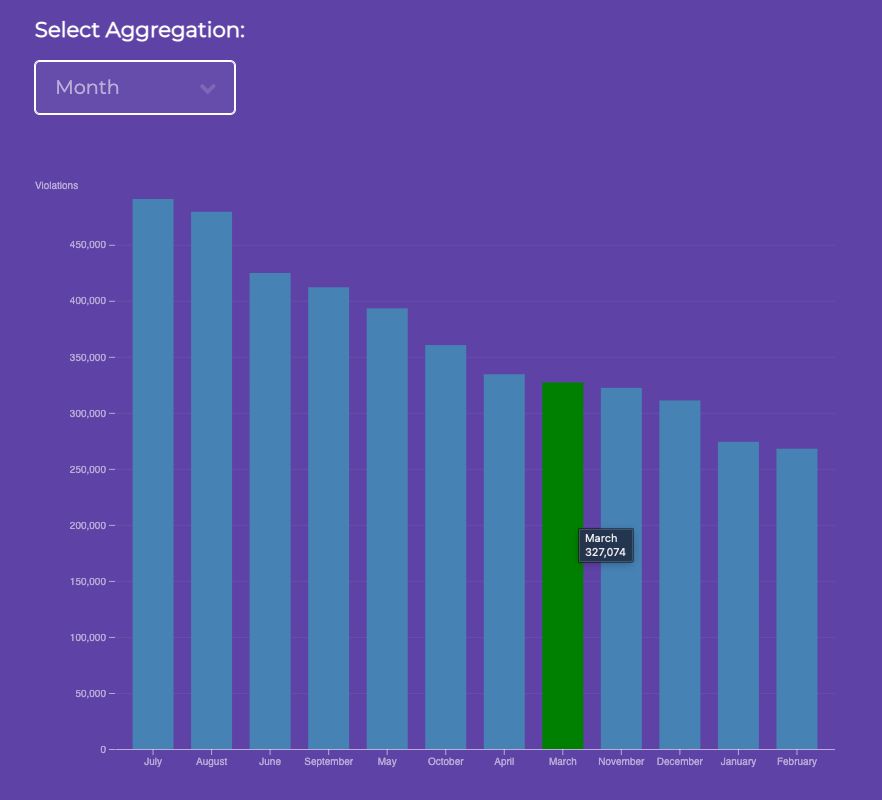
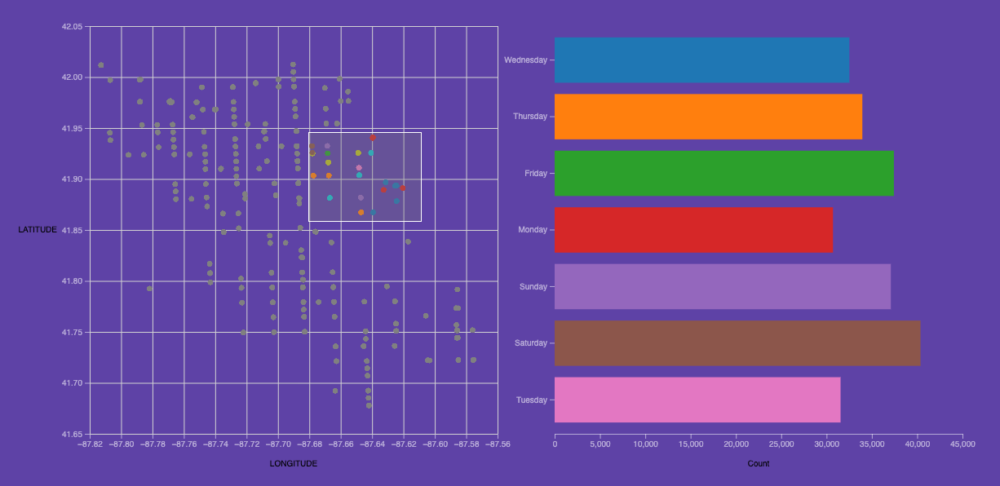

# CS 424: Project 3

### :earth_americas: Website

https://neilchawla.github.io/cs422_portfolio/

### :page_facing_up: Observable Notebook

https://observablehq.com/@neilchawla/cs-424-project-2

### :pushpin: About the Dataset

This dataset reflects the daily volume of violations created by the City of Chicago Red Light Program for each camera. The data reflects violations that occurred from July 2014 until December 2020, and contains about 800,000 observations for red light violations. The main attributes of interest from the dataset are:

- Intersection
- Violation Date
- Number of Violations
- (Latitude, Longitude) for the Violation location

This dataset contains categorial, numeric and DateTime attributes. The original dataset can be found on the City of Chicago website at - https://data.cityofchicago.org/Transportation/Red-Light-Camera-Violations/spqx-js37

### :scissors: Preprocessing

The raw dataset was first filtered to remove any missing/NaN values. The dataset was then manipulated and transformed using Pandas in order to create aggregations such as the number of violations grouped by Year, Day, and Month, as well as GeoJSON files used to create the visualizations.

---

### :bar_chart: Visualizations

#### Red Light Violation Map

### Question 1: Which intersections have recorded the most number of violations over time?

This visualization helps us observe the intersections recording the most number of violations over time. This can be particularly helpful in implementing additional measures to reduce the number of red light violations once areas reporting high numbers are identified. This also helps us understand the impact of development over the years on the number of violations reported at an intersection, and can be combined with other datasets to gather insights.

---

#### Red Light Violation Aggregations

### Question 2: Are there any trends that are observed over years, months, and days?

The total number of violations observed has been fairly consistent over the years, except for a sharp spike in 2021 and 2016. The spike in 2021 can be attributed to the reduction in city traffic due to the lockdown period, where people may have been jumping traffic lights due to fewer vehicles being around. However, more information would be required to account for the spike observed in 2016.

As for the violations observed over each month, the summer months from May to September record higher number of traffic violations as compared to the winter months. This is likely due to the unfavorable driving conditions that result due to rain and snow during winter.

When looking at the violations taking place over each day, the trend is fairly during weekdays. There are more violations observed on the weekend, which is likely due to people spending more time outside on their off days.

---

#### Red Light Violation Distribution by Day

### Question 3: How does the distribution of red light violations for each day differ over different regions of Chicago?

From the visualization above, it can be observed that intersections in the south have reported a lower number of red light violations as compared to the north. The number of violations observed increases as we move towards the eastern side, and this trend remains consistent. Furthermore, weekends remain the days with the most number of violations recorded, except for some regions in the middle eastern part where weekdays report higher numbers.

---

### :spiral_notepad: References

- https://observablehq.com/@d3/bar-chart?collection=@d3/charts
- https://observablehq.com/@d3/bar-chart-race
- https://observablehq.com/@fmiranda/homework-2
